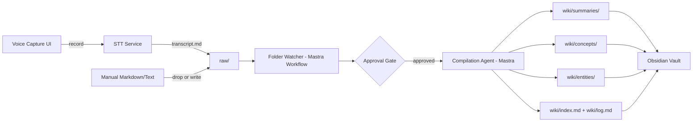

# Technical Specification
## OpenKB-for-Obsidian (Mastra Implementation)

### 1. Overview
A local-first knowledge-compilation system modeled on [VectifyAI/OpenKB](https://github.com/VectifyAI/OpenKB)'s architecture, reimplemented with **Mastra** (TypeScript agent framework) instead of OpenKB's Python stack (OpenAI Agents SDK + LiteLLM). A single `raw/` folder is the universal ingestion point — for both voice-derived transcripts and manually authored/dropped Markdown — and a Mastra agent compiles everything in it into a structured, Obsidian-compatible wiki.

### 2. Reference Architecture (upstream OpenKB, for parity)

```text
raw/                              You drop files here
 │
 ├─ Voice → STT → transcript.md ──┐
 ├─ Manual Markdown/text ─────────┤
 │                                ▼
 │                    Wiki Compilation (LLM agent)
 │                                │
 ▼                                ▼
wiki/                             │            ← the foundation
 ├── index.md            Knowledge base overview
 ├── log.md              Operations timeline
 ├── AGENTS.md           Wiki schema (LLM instructions)
 ├── sources/            Full-text conversions
 ├── summaries/          Per-document summaries
 ├── concepts/           Cross-document synthesis
 ├── entities/           Specific named things (people, orgs, places, products)
 ├── explorations/       Saved query results (Layer 2 — stretch goal)
 └── reports/            Lint reports
```

This project's MVP targets the **wiki foundation** layer (ingest → compile → maintain). Layer 2 (query/chat/skill factory) is a stretch goal, not MVP.

### 3. High-Level Architecture (this implementation)



### 4. Components

#### 4.1 Ingestion Layer
- **Voice capture**: mic recording UI (Obsidian plugin command, or standalone CLI/desktop trigger) → local `.wav` → STT call → Markdown transcript written to `raw/`.
- **Manual text/Markdown**: user writes or drops files directly into `raw/` — no distinct code path once the file exists; the watcher treats it identically to a transcript.
- **STT interface**: any OpenAI-compatible STT endpoint (Whisper-compatible `/audio/transcriptions`), configurable base URL/key/model.

#### 4.2 Folder Watcher (Mastra Workflow)
- Watches `raw/` for new/modified files (equivalent to upstream `openkb watch`).
- Also exposes an explicit "compile this file" trigger (equivalent to upstream `openkb add <file>`).
- On detection, enforces the approval gate (`requireApproval` setting) before invoking the compilation agent.

#### 4.3 Compilation Agent (Mastra Agent)
- **Framework**: Mastra agent(s)/workflow orchestrating LLM calls — the direct analog of OpenKB's OpenAI-Agents-SDK-based compiler, reimplemented in TypeScript.
- **LLM interface**: any OpenAI-compatible chat/completions endpoint, configurable base URL/key/model (parallel to OpenKB's LiteLLM multi-provider layer, but scoped to OpenAI-compatible endpoints for MVP rather than full LiteLLM provider coverage).
- **Steps per document** (mirrors upstream compilation flow):
  1. Generate a **summary** page for the new `raw/` document.
  2. Read existing **concept** and **entity** pages for context (retrieval over `wiki/concepts/` and `wiki/entities/`).
  3. Create or update **concept pages** — cross-document synthesis.
  4. Create or update **entity pages** — people, orgs, places, products (configurable entity-type vocabulary, matching upstream's default: `person`, `organization`, `place`, `product`, `work`, `event`, `other`).
  5. Update `wiki/index.md` (overview) and `wiki/log.md` (operations timeline).
- **Output format**: OKF-schema YAML frontmatter + Markdown body with `[[wikilinks]]` for every generated/updated page.
- **Instruction source**: a `wiki/AGENTS.md` file defines the wiki schema/conventions the agent follows at runtime — customizable without redeploying code, matching upstream's design.

#### 4.4 Vault/Wiki Writer
- Writes/updates pages under `wiki/summaries/`, `wiki/concepts/`, `wiki/entities/`, plus `index.md` and `log.md`.
- Must avoid silently overwriting manually edited wiki pages — flag conflicts rather than guessing (open question, carried over from PRD).
- Wiki directory is Obsidian-vault-compatible as-is (plain Markdown + wikilinks).

### 5. Data Model / File Layout

```text
<project-root>/
├── raw/
│   ├── 2026-07-05-11-22-31.wav                # voice audio (optional, source-of-truth)
│   ├── 2026-07-05-11-22-31.transcript.md      # voice → text
│   └── manual-note-2026-07-05.md              # user-authored/dropped text
└── wiki/
    ├── index.md
    ├── log.md
    ├── AGENTS.md
    ├── sources/          # full-text conversions of raw/ inputs
    ├── summaries/         # one per raw/ document
    ├── concepts/          # cross-document synthesis pages
    ├── entities/           # person/org/place/product/... pages
    ├── explorations/       # stretch goal (Layer 2 query/chat exports)
    └── reports/            # lint-equivalent health reports
```

### 6. Settings Schema (draft)

```yaml
llm:
  baseUrl: string
  apiKey: string
  model: string
stt:
  baseUrl: string
  apiKey: string
  model: string
workflow:
  requireApproval: boolean     # default: true
  rawFolder: string            # default: "raw/"
  wikiFolder: string           # default: "wiki/"
  watchMode: boolean           # default: true — continuous watcher vs. manual "add" trigger
entityTypes:                   # optional override of entity-type vocabulary
  - person
  - organization
  - place
  - product
  - work
  - event
  - other
```

### 7. Key Technical Risks
| Risk | Notes |
|---|---|
| Mastra ↔ upstream parity | Upstream OpenKB's compilation prompts/logic are Python + OpenAI Agents SDK; porting the multi-step agent behavior faithfully to Mastra workflows needs careful prompt/step parity, not just a rewrite in a new language |
| Raw-source ambiguity | Once a voice transcript and a manually written note both sit in `raw/`, the compiler must handle both uniformly — no voice-specific special-casing should leak into the compilation step |
| Concept/entity merge conflicts | Repeated compilation runs must update existing concept/entity pages rather than duplicating them — requires reliable page identity/matching, not just filename conventions |
| OKF compliance | Generated frontmatter must be validated against the OKF schema to remain portable |
| Watcher reliability | A continuously running `watch` process needs to handle partial writes, debounce rapid edits, and recover from crashes without double-compiling |
| Provider variability | "OpenAI-compatible" is a spectrum; some self-hosted endpoints may not support every parameter used |

### 8. Suggested MVP Tech Stack
- **Agent orchestration**: Mastra (TypeScript/Node) — workflows for watch/add + agents for compilation steps.
- **Folder watching**: Node-native `fs.watch`/`chokidar` (functional analog to Python's `watchdog`, used by upstream OpenKB).
- **STT/LLM calls**: HTTP client against user-configured OpenAI-compatible endpoints.
- **Voice capture UI**: Obsidian plugin (TypeScript, Obsidian Plugin API) if integrated directly into Obsidian, or a standalone companion app/CLI if decoupled from the editor — **open decision, not yet settled** (see PRD open questions).
- **Wiki output**: plain Markdown files with YAML frontmatter (OKF schema) and `[[wikilinks]]`, written directly into the vault/wiki folder.
